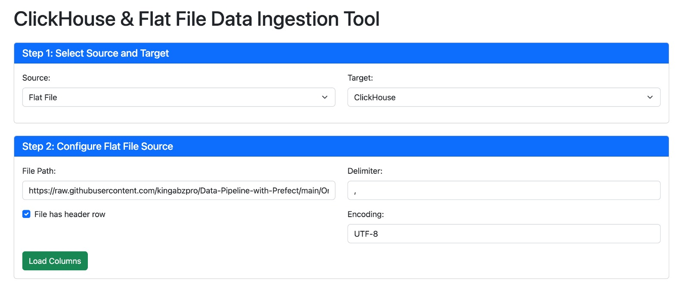
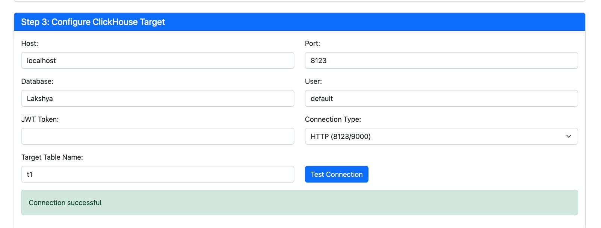

# ClickHouse & Flat File Data Ingestion Tool

A bidirectional data ingestion tool that facilitates data transfer between ClickHouse databases and Flat Files. This web-based application provides a simple user interface for configuring connections, selecting columns, and executing data transfers.

## Features

- Bidirectional data flow (ClickHouse to Flat File and Flat File to ClickHouse)
- JWT token-based authentication for ClickHouse
- Column selection for targeted data ingestion
- Data preview before ingestion
- Multi-table JOIN support (bonus feature)
- Progress tracking and completion reporting

## Prerequisites

- Java 8 or higher
- Maven 3.6 or higher
- ClickHouse database (local or remote)

## Setup Instructions

### 1. Clone the Repository

```bash
git clone <repository-url>
cd Integration
```

### 2. Build the Application

```bash
mvn clean package
```

### 3. Run the Application

```bash
java -jar target/integration-0.0.1-SNAPSHOT.jar
```

Alternatively, you can run it directly with Maven:

```bash
mvn spring-boot:run
```

### 4. Access the Application

Open your web browser and navigate to:

```
http://localhost:8080
```

### 5. Add Images

Add images for successful build and data ingestion here.
<a>
## Usage Guide

### ClickHouse to Flat File

1. Select "ClickHouse" as Source and "Flat File" as Target
2. Configure ClickHouse connection details (Host, Port, Database, User, JWT Token)
3. Test the connection and load tables
4. Select a table and load its columns
5. Configure the target Flat File (path, delimiter, etc.)
6. Select columns for ingestion
7. Preview the data (optional)
8. Start the ingestion process

### Flat File to ClickHouse

1. Select "Flat File" as Source and "ClickHouse" as Target
2. Configure Flat File details (path, delimiter, header info)
3. Load columns from the file
4. Configure ClickHouse connection details
5. Specify the target table name
6. Select columns for ingestion
7. Preview the data (optional)
8. Start the ingestion process

### Using Multi-Table JOIN (Bonus Feature)

1. Follow steps 1-3 of ClickHouse to Flat File
2. Enable "Multi-Table Join" checkbox
3. Select additional tables for the JOIN
4. Specify the JOIN condition (e.g., "table1.id = table2.id")
5. Continue with steps 5-8 of ClickHouse to Flat File

## Testing

The application can be tested with ClickHouse example datasets:

- uk_price_paid
- ontime

These datasets can be loaded into your ClickHouse instance following the instructions at:
https://clickhouse.com/docs/getting-started/example-datasets

## Configuration

The application's server port and other settings can be configured in `src/main/resources/application.properties`.

## Technologies Used

- Spring Boot 2.7
- ClickHouse JDBC Driver
- Apache Commons CSV
- Thymeleaf
- Bootstrap 5
- jQuery


